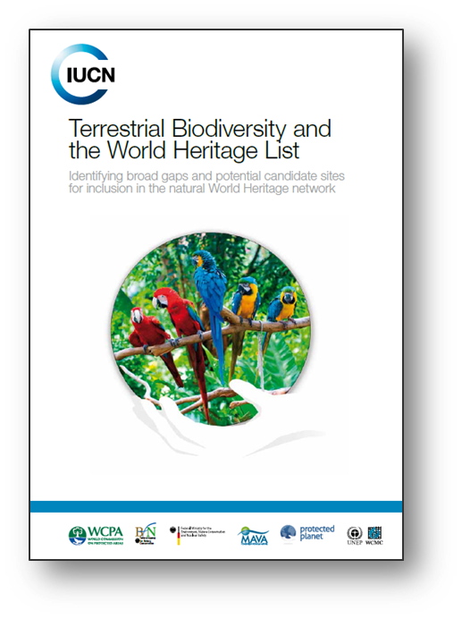
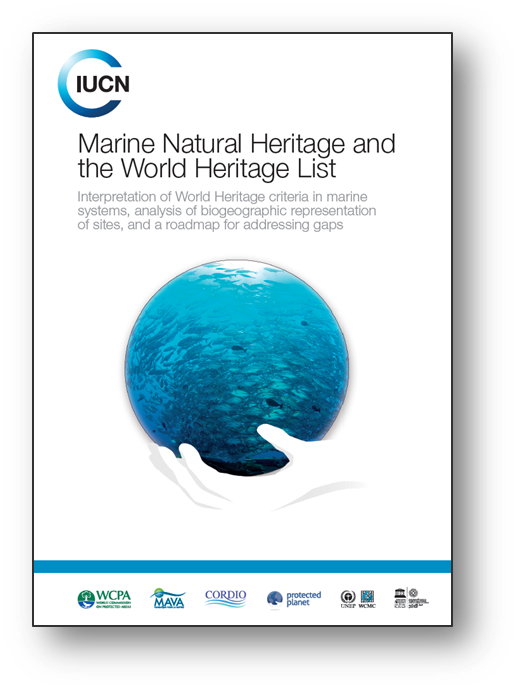
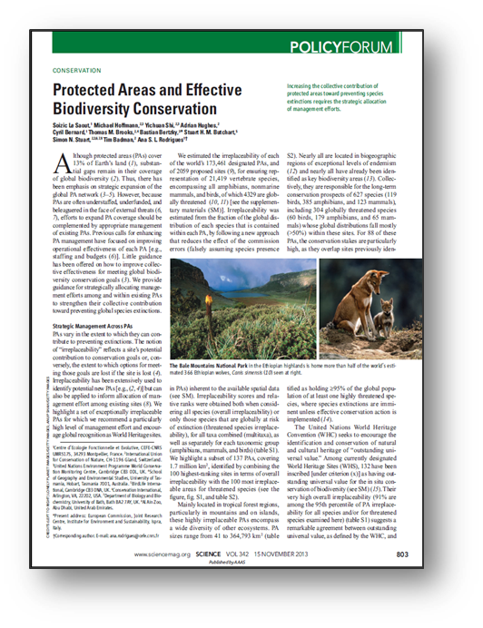
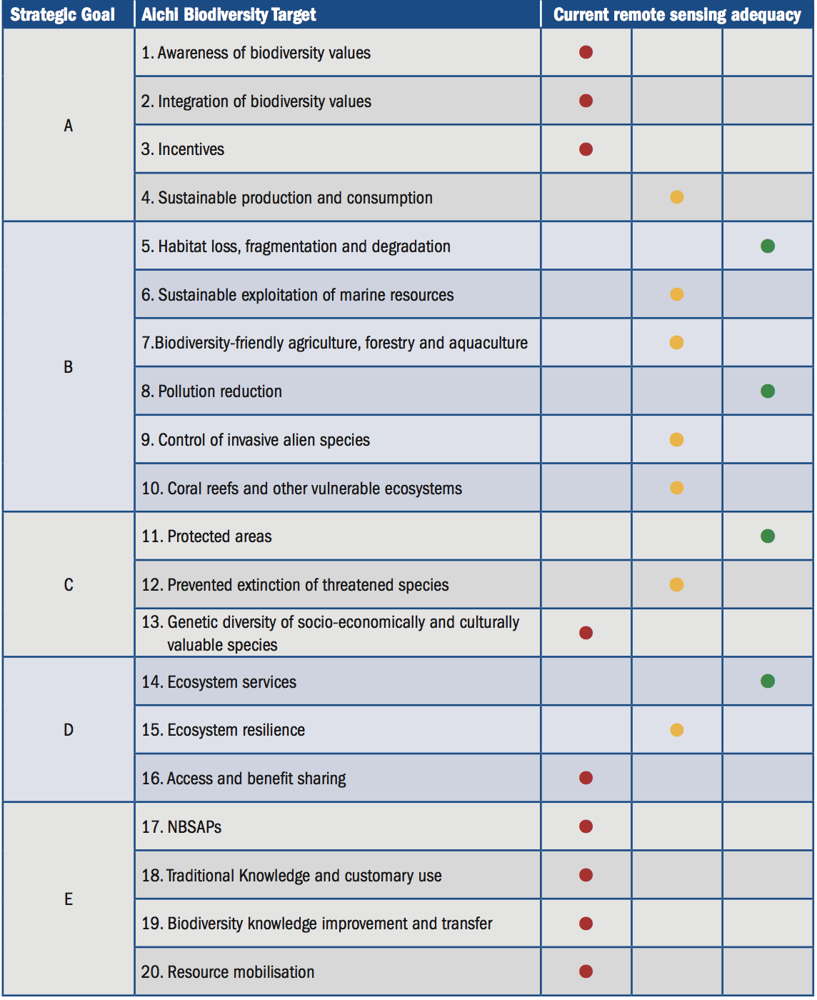
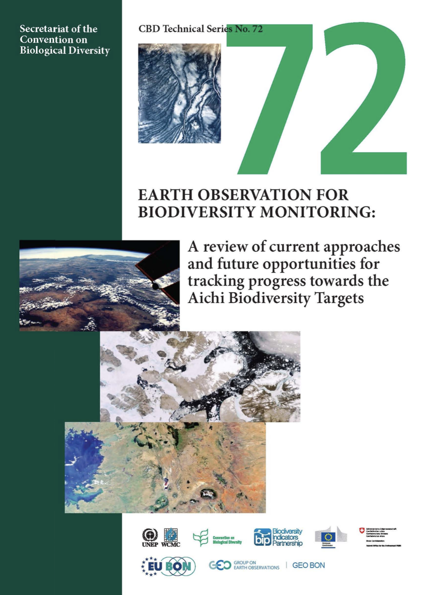
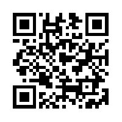

<!--============ INTRO -->
# welcome
<!-- .slide: data-background="beijing_assets/beijing_stamen.png" -->
 
<small>Yichuan Shi</small> 
<small>史一川</small>
note: thank invitation to organiser 
grateful to be here  

## about me
<!-- .slide: data-background="beijing_assets/beijing_stamen.png" -->
note: background in GIS/remote sensing, 2009 Cambridge graduate  
UN environment secondment IUCN for 7 years  
my roles: technical input to all three: specifically manage global NWHS data, research on natural WH heritage, comparative analysis, and research papers  
you may be more experienced, introduce my work, hope of use to you; opportunity for me also to learn from you   

## about the course
<!-- .slide: data-background="beijing_assets/beijing_stamen.png" -->
- Presentation
- Participation
- Tutorials and hands-on exercises
note: it's about building your capacity  
not to help you become remote sensing specialist over 8 hours. Crush course 1: overwhelming information 2: extremely boring technical details  
- aims: 1. basic ideas on the principles 2. aware of the technology available 3. workflow 4. what is being done, what can be done. Walk away with any of the above, missions accomplished.  
- light, relaxed as no technical terms; get you to think and participate  
- old Chinese proverb: 三人行必有我师 (Stay hungry, Stay foolish), some of you may have far more experience in some respect, I’d like to welcome and encourage interventions and comments (don’t be shy), one of the objective is to facilitate the flow of information so that we learn mutually from one another  
- long day: structure up front, a) outlines of the modules b) summary or review after each section (to help them remember)  

## the (draft) outline
<!-- .slide: data-background="beijing_assets/beijing_stamen.png" -->
- Introduction on IUCN and UNEP-WCMC
- Introduction on earth observation and biodiversity conservation
- Case study: Landsat archive (data access)
- Case study: Human footprint and forest loss (analysis)
- Case study: Land cover change (visualisation and story telling)
- Introduction on IUCN's digital initiative
note: presentation, hands-on exercise

<i class="fa fa-users fa-5x"></i>
### What do you think
<!-- .slide: data-background="white" -->
note: group exercise and reporting back in 5 minutes  
- understand that participants may have different background, experiences and expertise, ensure the course is stretched to cover the majority of interest and is useful + I understand different background, needs and expectations  
- flexible to cover different content, adjust focus if needed  
- are there specific things you would like to talk about etc  
- blackboard: your expectation of this course -> your objectives, your challenges, your needs  
- challenges: 
    a. vastly different landscapes, abundance data, sufficient temporal spatial resolution, good algorithm, computing power.
    b. mismatch between what are needed, and what currently are available  
- objectives: understand WH management
- needs: data methodology, project 

<!-- =========== ABOUT CENTRE -->
# about us
<!-- .slide: data-background="wcmc-0.jpg" -->
  
United Nations Environment Programme  
World Conservation Monitoring Centre  
(UNEP-WCMC) 
Note: 35 yrs +, Cambridge, 100+, biologist, computer scientist, economist, GIS professionals, programmers

### To put biodiversity at the heart of decision-making
<!-- .slide: data-background="wcmc-1.jpg" -->
Note: biodiversity arm of UN Environment, most to do biodiv conservation; question: what's biodiversity + answer; 

### Unlock the power of data
<!-- .slide: data-background="wcmc-2.jpg" -->
Note: driven by data, maintain multiple global databases (e.g. ocean data viewer, WH, species trade); analysis/make sense; modelling analytical 

### The strength of many
<!-- .slide: data-background="wcmc-3.jpg" -->
Note: coordination: world wide partners, international, national research, private, NGOs and foundations

### science and policy interface
<!-- .slide: data-background="wcmc-4.jpg" -->
Note: closely with multilateral conventions; measure our impact, not just by how good we do science, but to make sure change for a better conservation outcome

<!--========= WORK UNDER CONVENTION -->
# the convention
>Heritage is our legacy from the past, what we live with today, and what we pass on to future generations. Our cultural and natural heritage are both irreplaceable sources of life and inspiration
Note: questions: how much do you know about WH; since 1972, 192 SP, one of the most adhered conventions; one of the most effective for conservation;

<!--== our work -->
## Role under the Convention
Support IUCN on biodiversity sites
- Evaluation of new natural and mixed nominations  <!-- .element: class="fragment"-->
- Monitoring of existing sites  <!-- .element: class="fragment"-->
- Policy, guidance and research <!-- .element: class="fragment"-->
Note: question: what is it we do - well...

<!--=== evaluation -->
## 1. Evaluation
<!-- .slide: data-background="white" -->

### The process

<!--  -->

### World Database on Protected Areas
<!-- .slide: data-background="pp.png" -->
<a target='_blank' href='http://www.protectedplanet.net'>protected planet</a>
<!-- only way to allow new page -->
Note: much of the evaluation we do rely on it. DEMO

### Comparative Analysis
For biodiversity nominations
Note: unbiased, impartial, independent expert assessment. Data driven, literature...

<!--== monitoring -->
## 2. Monitoring
<!-- .slide: data-background="white" -->

### Statutory process
Note: periodic reporting (6 years), SOC report, reactive/reinforced monitoring/missions, danger listing, and ultimately de-list

### We need to be proactive
Note: often slow to react, often too late

### world heritage outlook
Example: <a target='_blank' href='http://www.worldheritageoutlook.iucn.org/search-sites/-/wdpaid/en/2571'>The Great Barrier Reef</a>
Note: IUCN initaitive to pro-active, identify issues before major, effective mitigation measures

<!-- .slide: data-background-image="who.jpg" -->
Note: mobilise voluntary expert groups across the world, impartial assessment conservation outlook, every five years to see trend

### monitoring forest loss
<a target='_blank' href='http://www.globalforestwatch.org/map/'>Global Forest Watch</a>

<!-- .slide: data-background-image="10902.png" -->
Note: make use of 30m global forest loss data

### remote sensing
<!-- .slide: data-background-image="rs.gif" -->
Note: powerful, cost efficient way for large scale monitoring

<!-- .slide: data-background-image="l8_okavango.gif" -->
Note: okavango delta, landsat 8, 30 meter resolution

<!-- <iframe  width="1080" height="700" data-src="https://earthengine.google.com/iframes/timelapse_player_embed.html#v=22.16343,113.56346,11.601,latLng&t=2.43" frameborder="0"></iframe> -->
<iframe width="1080" height="700" src="https://earthengine.google.com/iframes/timelapse_player_embed.html#v=39.98967,116.49397,10.024,latLng&t=1.94" frameborder="0"></iframe>
Note: powerful computation, big data. Macau, google earth engine  
more later: data availability and computation power available

<!--==== upstream -->
## 3. Policy, Guidance and Research
<!-- .slide: data-background="white" -->

<!-- .slide: data-background="carto-0.png" -->
Note: the WH convention is not without its problems; one of which is the huge divide geographically and politically

<!-- .slide: data-background-image="carto.png" -->
Note: cartogram by number of sites

### best practices guidance documents
Note: reports etc

### thematic studies

Note: terrestrial biodiv, marine WH, benefits study, published in Science

<i class="fa fa-coffee fa-5x"></i>
## Take a break!
<!-- .slide: data-background="white" -->
note: ask them to create a free esri account，if you haven't

<!-- ======= REMOTE SENSING AND BIODIVERSITY CONSERVATION -->
# Remote sensing and biodiversity conservation
<!-- .slide: data-background-iframe="./krakow_assets/globe.html" -->
note: natural WH, monitoring for conservation of biodiversity

<i class="fa fa-users fa-5x"></i>
### questions
<!-- .slide: data-background="white" -->
1. top 3 most urgent needs for conservation
2. top 3 conservation opportunities using remote sensing
3. top 3 challenges using remote sensing
note: why do we need remote sensing  
each person -> three post it different colour, one for each question  
keep it brief  

## biodiversity targets
<!-- .slide: data-background="#595C5F" -->
1. Current operational Earth observation products
2. To what extent do they address the needs
3. What are the limitations

<!-- .slide: data-background="#595C5F" -->

## case: protected areas
<!-- .slide: data-background="#595C5F" -->

### Target 11. Protected areas
<!-- .slide: data-background="#595C5F" -->
>By 2020, at least 17 per cent of terrestrial and inland water, and 10 per cent of coastal and marine areas, especially areas of particular importance for biodiversity and ecosystem services, are conserved through effectively and equitably managed, ecologically representative and well connected systems of protected areas and other effective area-based conservation measures, and integrated into the wider landscapes and seascapes.

### Operational Indicators
<!-- .slide: data-background="#595C5F" -->
- Trends in coverage of protected areas (A)
- Trends in protected areas conditions and management effectiveness (A)
- Trends in representative coverage of protected areas of sites of particular biodiversity importance (A)
- Trends in the connectivity of protected areas (B)
note: that can be (partly) derived from remotely- sensed data  
The Ad Hoc Technical Expert Group on Indicators for the Strategic Plan for Biodiversity 2011-2020 identified three categories of operational indicators. Indicators which are ready for use at the global level are denoted by the letter (A). Indicators which could be used at the global level but which require further development to be ready for use are denoted by the letter (B). Additional indicators for consideration for use at the national or other sub- global level are denoted by the letter (C) and given in italics. The set of (A) and (B) indicators are those which should be used to assess progress at the global level, while the (C) indicators are illustrative of some of the additional indicators available to Parties to use at the national level, according to their national priorities and circumstances.

### Relevant Operational EO products
<!-- .slide: data-background="#595C5F" -->
Land cover and land cover change, Normalized Difference Vegetation Index (NDVI), NDVI-derived anomalies such as the Vegetation Condition Index or the Vegetation Productivity Index, Leaf Area Index (LAI), Fraction of Absorbed Photosynthetically Active Radiation (FAPAR), re extent, Global Forest Watch 2.0

### Limitation
<!-- .slide: data-background="#595C5F" -->
Protected area condition cannot always be assessed using remote sensing, for example, selective logging, invasive species, and agricultural encroachment can be missed, and hunting is not detectable.

<!-- ====== DATA ACCESS:  -->
# Access remote sensing data
<!-- .slide: data-background-iframe="./krakow_assets/globe.html" -->
note: a type of data science  
data - information - knowledge holds true  
appropriate resolution, timely, and good quality data matter, garbage in and out

<i class="fa fa-users fa-5x"></i>
### Where do you get data from? What data?
<!-- .slide: data-background="white" -->
note: six groups. Discuss between your selves and invite each person to report  
what data have you used before, for what purpose? where do you get from? Is it suitable for your purpose

# near real-time landsat 8 imagery
<!-- .slide: data-background="./gland_assets/b4.jpg" -->

## Landsat archive project
<!-- .slide: data-background="#A45209" -->
note: why need for data. Colleague question do you have data for a threat we know on the ground. Not easy, not cheap  
aim: when new data available

<!-- .slide: data-background="http://i.giphy.com/LwAjTGdSWNRYc.gif" -->
note: yes

### ...but, not so easy...
<!-- .slide: data-background="./gland_assets/dogfail.gif" -->

## challenges
<!-- .slide: data-background="#A45209" -->
- Big data: volume, velocity, variety
- Computation power and storage space
- Management cost

## how we did it
<!-- .slide: data-background="#A45209" -->
- (Automate) download
- (Automate) pre-processing
- (Automate) data management

## Landsat 8 imagery in the cloud
<!-- .slide: data-background="#A45209" -->
note: archiving, no longer relevant -> no need to host data in house while it's ubiquitous and easily accessible

## What do they look like... **NOW**?
<!-- .slide: data-background="#A45209" -->
note: move away from the original goal, frees time for more interest work
1) Time series data, finds the best image (cloud free) in any past given time range. composition of spectra.  
2) already an idea or on information that is reported, photographic proof if there is any supporting evidence from remote sensing

<!-- .slide: data-background-iframe="https://www.mapbox.com/bites/00114/" -->
<!-- .slide: data-background="#A45209" -->
note: cloud, web services: data is on the internet and can be easily accessed and customised without the need to download. Computation on the cloud

## future beyond pretty pictures
<!-- .slide: data-background="#A45209" -->
note: as it stands only visuals - immense opportunity and potential to better visualise but also analyse in the cloud.
1) change of NDVI, vegetation index overtime  
2) give you land cover classification on the fly, dynamically (GEE) - tell you also what they are and how they change

## demo
<!-- .slide: data-background="#A45209" -->
- <a href='http://wh-app.yichuans.me/landsat' target='_blank'>Landsat 8 for natural World Heritage</a>
note: first web service based product. Dynamic in that as long as new data comes in, the maps will be automatically updated. Little or no maintenance cost.

<i class="fa fa-book fa-5x"></i>
## exercise
<!-- .slide: data-background="white" -->
note: band combination traditional and doing it online (consume a web service with filtered dates) this will serve as a first step for the final exercise

<!-- ==== ANALYSIS -->
# Human footprint and forest loss
<!-- .slide: data-background="#8C68CB" -->
note: 

## paper of the month award
<!-- .slide: data-background="#8C68CB" -->
note: iucn contributed a paper that uses the google earth engine to quantify human footprint change and forest loss. It won an award by elsevier out of more than 1000 journals

## amplify the impact
<!-- .slide: data-background="#8C68CB" -->
note: science paper has limited reach to people. therefore a web platform to communicate site specific information to users

## demo
<!-- .slide: data-background="#8C68CB" -->
- <a href='http://world-heritage-analyses.greenfirescience.com/human-footprint/' target='_blank'>Human footprint change</a>
- <a href='http://world-heritage-analyses.greenfirescience.com/forest-loss/' target='_blank'>Forest loss</a>
note: also attempt to get user feedbacks

# Google Earth Engine
<!-- .slide: data-background-iframe="./krakow_assets/spin.html" -->

## Hugely powerful
note: 1) petabytes of data already in the cloud, at the click of a button, sno need to download to analyse  
2) geospatial parallel computing in the cloud -> near real time result  
3) computation on the fly, calculations done at the time you request it  

## Surface water transition
note: we ran a test that uses the google earth engine to calculate surface water change in all natural world heritage sites

## demo
- <a href='https://yichuans413.appspot.com' target='_blank'>Google Earth Engine for surface water transition</a>
- <a href='https://earthengine.google.com' target='_blank'>Google Earth Engine documentation </a>
note: 1) explain global surface water  
2) refresh the page if inactive - the demo result is done in real time, no result is pre-cooked.

<i class="fa fa-coffee fa-5x"></i>
## Take a break!
<!-- .slide: data-background="white" -->
Install Anaconda if you haven't already

<i class="fa fa-book fa-5x"></i>
## exercise
<!-- .slide: data-background="white" -->
note: different ways, why open source, anaconda  
may be technical so not for everyone but nevertheless I feel compelled to mention it here, and give you a taste as we believe it is the future.  
open source, transparent methodology, collaborative and repeatable  
free to use, no vendor lock in, thus reducing the threshold of traditionally expensive software  

<!-- ==== PRESENTING INFORMATION -->
# land cover change
<!-- .slide: data-background="./gland_assets/b3.jpg" -->

## highest spatial resolution global land cover
GlobeLand30 - 30 meter resolution
<!-- .slide: data-background="OliveDrab" -->
note: 1. first time quantitative analysis of land cover for all natural sites  
2. thanks to 30 meter global land cover - datasets two time epochs using the same methodology thus change can be estimated

<!-- .slide: data-background="./krakow_assets/landcover.gif" -->
note: 1. what we did - calculate pixel by pixel change within each WH site  
2. calculate not only total amount but also the change, from each landcover classification

## new perspective for screening potential threats
<!-- .slide: data-background="OliveDrab" -->
note: validation required. it tells you what but not why - another source of potential threats.  
1. example, WHO assessment. Could refer to the LCC for any substantial change, if so, this signals an alert, if otherwise unknown, a possible damaging event. forest loss, water body change, amongst others.

## demo
<!-- .slide: data-background="OliveDrab" -->
- <a href='http://wh-app.yichuans.me/wh_app/landcover' target='_blank'>Land Cover change</a>
note: first time comprehensive, systematic land class mapping exercise, first time investigated the dynamics of change, first time used the web as a media to deliver findings

<i class="fa fa-book fa-5x"></i>
## exercise
<!-- .slide: data-background="white" -->
note: compare change map, story map; show the remote sensing journal  
create web map with three layers (WH, 2016 and 2005), and then web application for change difference  
if time, create a story map using the web map

<!-- ==== DIGITAL INITAITVE -->
# world heritage analyses
<!-- .slide: data-background-iframe="./krakow_assets/globe.html" -->

<i class="fa fa-spin fa-gear fa-5x"></i>
## Knowledge Lab
test ideas
<!-- .slide: data-background-iframe="./krakow_assets/cpc.html" -->
note: a) a platform for ideas, what can be done to utilise what's already there for natural World Heritage 
b) to bridge the gap or better facilitate between production of knowledge products and their consumption - in order be more impactful. 
c) I want a shift of delivering such analytical work to 1) easy to access and understand 2) more public facing, communication oriented

<i class="fa fa-internet-explorer fa-5x"></i>
## Web
<!-- .slide: data-background-iframe="./krakow_assets/cp.html" -->
communicating data, analyses and tools
note: 
a) to better reach audience by tapping into opportunities it offers 1. direct and ubiquitous access with internet 2. interactive and engaging 3. dynamic and agile, i.e., quick to modify and improve  
b) reports are less appealing, if I, as an author, can’t be bothered to read my own work of 70 pages. I find it powerless to convince other people to read.  
c) five minutes attention span. fundamentally there is too much information and too little time - People are busy, swamped by information around them, spoiled by the influx of wealth of information.

<i class="fa fa-child fa-5x"></i>
## You
<!-- .slide: data-background-iframe="./krakow_assets/posson.html" -->
your voice matters
note: 1) aim empower you by informing you   
2) must be useful for end users  
3) hear from you, give you the data and tools to enable you. everything is open

<i class="fa fa-cogs fa-5x"></i>
## how
note: QUICKLY go through them, still useful 

## keep it simple
(and do less!)
<!-- .element: class="fragment" -->
note: 1. it is not rocket science, nor even research we do - risk losing out of touch - no need to be complicated and full of jargons.  
2. it is about what we do; but also about what we don't do -> concious of resource. a) Don't reinvent wheel. b) Do less but do it very well.
3. concious of limited resources; one thing at a time, set ambitious goals but with achievable low aims

## extendible and scalable
link, provide services, and extend beyond WH
note: with future extendibility in mind.  
1. intrinsically not in isolation - imperative connection to existing more established KP   
2. easily extendible to have additional functionality. modern architecture, web services  
3. WH trailblazing, but equally could be scaled up to other protected areas

## open
Data, methodology and result
note: open data, open technology and open accessibility. Source code, analytics reproducible. empower others.
1. certainly external pressure to be open, because many are open  
2. personal view that data etc should not be held back.  
3. benefits from transparency: allow comments, healthy debate that leads to better ideas, solution and outcome. 2) empower others

## responsive
any device
note: 
1. maximise accessibility. no matter what terminal device is used. to make it easy for them
2. mobile first design. 

## demo
- <a href='http://world-heritage-analyses.iucn.org' target='_blank'>http://world-heritage-analyses.iucn.org</a>
note: demo knowledge lab

# World Heritage spatial data
<!-- .slide: data-background="./gland_assets/b6.jpg" -->

<!-- .slide: data-background="./krakow_assets/gis.gif" -->
note: 
1. boundary importance for evaluation, monitoring and upstream research and policy 
2. major refresh since 2011, digitised 150 of 200 sites, annual update 
3. humble beginning as KML to flexible data products  
4. continous improvement, updates after committee meeting and when best data is available, next update July 

## Wait...
<!-- .slide: data-background="#0072b1" -->
Didn't we already have ProtectedPlanet?
note: noting the good things - but clunky, no dedicated or even intuitive interface for just WH sites; cannot be easily extended for use outside protectedplanet

<i class="fa fa-cloud fa-5x"></i>
## World Heritage boundary 
as a data service
<!-- .slide: data-background="#0072b1" -->
note: it's all about enabling you to fully use the data and do amazing things 
E.g. A prioritisation exercise where was asked to look at the relationship between intact forest and existing WH sites, with a view to identifying sites with significant overlap. 238 maps were, to the maximum detail, despite the massive effort (more than 1G in file size). Cannot address every user needs, which may have specific focus somewhere, look at a bigger picture -> why not enable them to do it themselves? The WH boundary service lets you do just that. 

## demo 
<!-- .slide: data-background="#0072b1" -->
- <a href='http://wcmc.io/3f3e' target='_blank'>World Heritage viewer</a>
- <a href='http://wcmc.io/world-heritage-data' target='_blank'>World Heritage data service metadata</a>
- <a href='http://wcmc.io/wh-story-2016' target='_blank'>2016 inscription story map</a>
note: quickly run through the examples

# World Heritage information sheets
<!-- .slide: data-background="#595C5F" -->
note: <strong>Elise to take over</strong>

## history
<!-- .slide: data-background="#595C5F" -->
note: 1) concise digest of nominations files, fallen out of use  
2) still useful but usefulness plagued by accessibility (explain before)

## overhaul
<!-- .slide: data-background="#595C5F" -->
note: 1) a major revision was undertaken to revitalise as a source of useufl information  
2) web based + search functionality

## demo
<!-- .slide: data-background="#595C5F" -->
- <a href='https://yichuans.github.io/datasheet/output' target='_blank'>Natural World Heritage information sheets</a>
note: demo a case site + search + by country

# climate change vulnerability
<!-- .slide: data-background="./gland_assets/b2.jpg" -->

## on the shoulders of giants
powered by species climate change vulnerability assessments
<!-- .slide: data-background="#3b5998" -->
note: 
1. based on the work by Foden 2012, GSP.  
2. reuse their finding and make it relevant for WH

## sensitivity, low adaptability and exposure
<!-- .slide: data-background="#3b5998" -->
note: 
1. the concept: is it sensitive to cc, traits adaptable, will it be exposed  
2. only when they are high score of all three, are they considered climate change vulnerable  
3. scores are relative. Thus can't compared across taxa

## outlook from the lens of species
<!-- .slide: data-background="#3b5998" -->
note: 
1. infer species within WH using RL  
2. aggregate all species CCV results within WH  
3. Are species most vulnerable outside WH or inside  
4. to what extent do WH provides refugee, high number of ccv species, management responses  
5. useful for monitoring work. What are the sites that are ccv? in those sites, what are the species that are ccv? What traits leads to their ccv status? What management response could be? delineation based on future extent of such species?

## demo
<!-- .slide: data-background="#3b5998" -->
- <a href='http://nbviewer.jupyter.org/github/Yichuans/climate-vulnerable-wh/blob/master/report.ipynb' target='_blank'>Brief report</a>
- <a href='http://nbviewer.jupyter.org/github/Yichuans/climate-vulnerable-wh/blob/master/workspace.ipynb' target='_blank'>Reproducible methodology, analysis and findings</a>
- <a href='http://wh-app.yichuans.me/ccv' target='_blank'>Result for each natural and mixed World Heritage site</a>
note: versioned, reproducible, communication oriented. first time data analytics: version controlled, open, accessible, scientific product. New thinking of delivering and communicating knowledge product through means other than lengthy text

# spatial comparative analysis
<small>(Prototype)</small>
<!-- .slide: data-background="./gland_assets/b5.jpg" -->

## gaps and comparisons, spatially
<!-- .slide: data-background="#8c0303" -->
note: from a data point of view, identify where broad gaps are; if a hypothetical site is to be submitted, how does it compare to existing sites. not to be prescriptive

## proof of concept
for now
<!-- .slide: data-background="#8c0303" -->
note: to replicate desktop system and make it accessible -> enable wider public to undertake a first screening of their intended sites

## full development
replicating full functionalities of spatial comparative analysis
<!-- .slide: data-background="#8c0303" -->
note: 1) prototype done  
2) full specification done and next step fund raising, in order to
a. proper spatial analysis  
b. complete datasets  
b. improved user experience

## demo
<!-- .slide: data-background="#8c0303" -->
- <a href='http://whca.yichuans.me' target='_blank'>Spatial comparative analysis prototype</a>
note: web GIS for the first time, complete system that takes input from the frontend interface, pass onto an underlying GIS database for analysis and then return the result to the web.

# challenges & opportunities
<!-- .slide: data-background="./gland_assets/b7.jpg" -->
note: two sides of the same coin - synonymous;

<i class="fa fa-rocket fa-5x"></i>
## technology is fast evolving
<!-- .slide: data-background="#1B5E20" -->
note: 
All parts of GIS in the cloud  
amazing speed of evolution. e.g. GIS: storage, analysis, presentation of geographic information -> in the cloud, accessible, and dead simple. e.g. irrelevance of initial effort to archive Landsat 8 data in house.
disruptive innovation may drive some of work obsolete.

<i class="fa fa-spin fa-gear fa-5x"></i>
## capacity
<!-- .slide: data-background="#1B5E20" -->
note: 
1. natural need to catch up with the rest of the world  
2. training to catch up: cloud based computing  
3. harness the power or work risk being made irrelevance in the not-too-distant future.

<i class="fa fa-dollar fa-5x"></i>
## resource
<!-- .slide: data-background="#1B5E20" -->
note:
1. no funding  
2. missed opportunity to make even bigger impact. Split between doing the work, WHO: compile expert knowledge <-> delivering the message to the end users.  
3. never a one-off effort, maintenance, honing.  
4. good understanding of resource requirements for creating good products that are robust and long term sustainable, e.g. WHO. scope large, functional, but to do it properly, need more resources.  
5. not professional development

<i class="fa fa-child fa-5x"></i>
## your voice matters
<!-- .slide: data-background="#1B5E20" data-background-iframe="./krakow_assets/posson.html"  -->
note: ultimately it is the users we want to influence, educate and modify their behaviours. Without user buy-in, it would be hard work, with little impact. That's why here today, advocating and trying to convince you that 1) this is indeed a good idea 2) get you on-board this journey and get your feedbacks 3) first users to start using and promoting them.

<!-- .slide: data-background="#1B5E20" -->
 
<a href='http://world-heritage-analyses.iucn.org' target='_blank'>http://world-heritage-analyses.iucn.org</a>

# questions
<!-- .slide: data-background="./gland_assets/b8.jpg" -->

<!-- .slide: data-background="beijing_assets/beijing_stamen.png" -->
Thank you  
<a href="#/"><small>restart</small></a>
