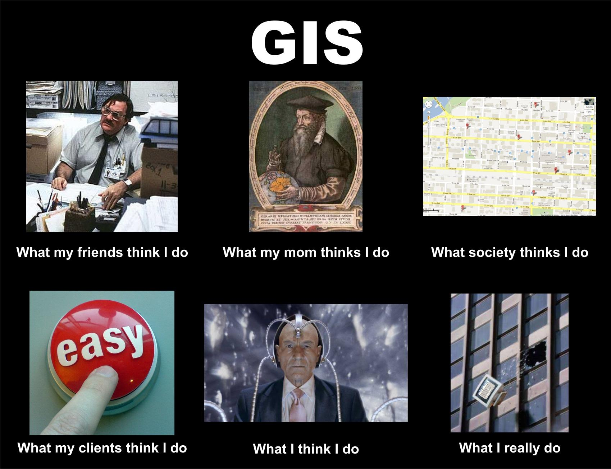
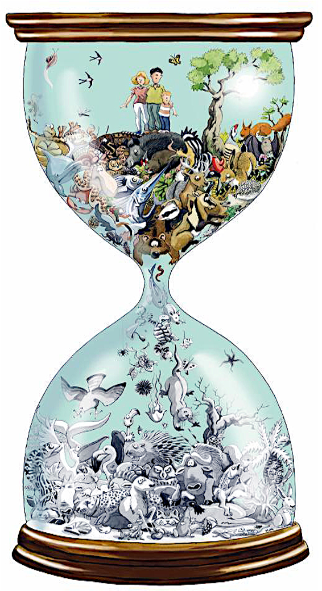
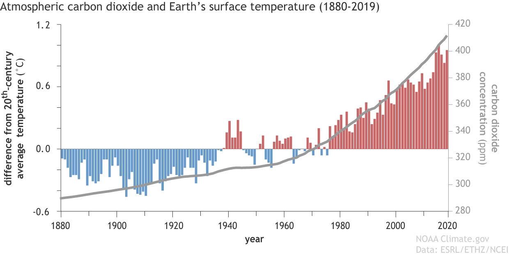

# Hello
<!-- .slide: data-background="./beijing_assets/beijing_stamen.png" -->
note: 1. thank Ni Huan, GLY 2. why use English 3. style of presentation, interactive, definitely not a lecture, not presentation but talk

### About me
<!-- .slide: data-background="white" -->

note: CN might be curious about me academic process - been ask to share; 1. ordinary student, gaokao, like many, ZJU, worked hard, played hard; 2. HKU, got lucky open another non Chinese speaking world; 3. Cam, extra lucky not being humble, four exercies, failed the first, it was probably above my station - super bright students and competitive, nian ya; -> open eyes

### About me
<!-- .slide: data-background="black" -->

note: CN: UK, not a migrant country, 1. different (1. no mass recruit 2. project dependent), first job exp volunteered at IUCN; IUCN, WCMC, CI; 2. it becomes easier with time (1. exp 2. reputation 3. language)  could not speak the language - robert, robot; 3. technical competence in maths and coding in non-technical field in short supply; 4. tolerance + situational leadership

## Area based biodiversity conservation 
<!-- .slide: data-background="./generic_assets/wcmc-1.jpg" -->
note: 1. switch now to English, 10 years. a topic i'm most personally involved through work; 2. protected or conserved area - implementation the only way

<!-- .slide: data-background="./gly_assets/wenjjabao.jpg" data-background-size="contain" -->
note: 1. hard task, quite nervous 2. the "I remember nothing joke"; look back at presentation for inspiration; but thinking back, Wen Cambridge, aura, great speech, look back do not remember a thing, yes a shoe was thrown which i remember, but his quick thinking, and remembering me being in it thinking how he might deal with it. 

### convention, communication and conversation 
<!-- .slide: data-background="./generic_assets/wcmc-1.jpg" -->
international science policy interface
note: 1. (jokingly) in truth and reality with 10 years under my belt, there is far more I don't know, nor do I not qualified to talk about such a big topic, 2. one thing i dread is taking responsibility for inadverdently misleading bright minds astray from conservation or other promising careers; 3. so i thought i better focus not on the technical details, which I can guarantee you will not remember, which is a good thing, because the most important things does not need memorizing, but rather on the thought process and my own stories, and think with me, when through the presentation, ask quesitions and critique

## Outline
<!-- .slide: data-background="./generic_assets/wcmc-1.jpg" -->
- Problem statement
- Convention: framework for everything
- Communication: mechanism science and policy
- Conversation: impact and effectiveness
note: 1. based on my experience and my understanding, 2. the content might or might not be of interest but i hope the thinking process behind it might be useful, of interest and relevant

## Problem statement
<!-- .slide: data-background="white" -->

note: 1. knowing the problem is half the solution; the most difficult - the better one understands the problem the better one is able to provide a solution - so important to get; 2. in our case it is simply this: “Anyone who believes that exponential growth can go on forever in a finite world is either a madman or an economist" - I, for one, believe that there is limit on growth - this is a law in physics 

### climate change
note: question, what is it, asking students to describe, why is it a problem? I know this might be so clique, but it's important. For those wanting to get to Oxbridge, there is an anecdote - at interview, the banana. In fact true and there is a book about it, titled: tell me about a banana.

### climate change
<!-- .slide: data-background="white" -->

### loss of biodiversity
note: question, what is it and why does it matter...

### loss of biodiversity
<!-- .slide: data-background="white" -->

## challenges 
<!-- .slide: data-background="white" -->
note: in understanding the issues - do we know the issue and the scale of the issue. 

### Facts
(Is this really happening?)
note: 1. huge in the past and now consensus; 2. scale of research - temporal, spatial and curse of dimensionality - super complex; 3. can it be attributed to us, country, industry; can it be mitigated; 4 by nature very hard to communicate: research joke, stating the bloody obvious, far too complicated that nobody understands.

## convention
<!-- .slide: data-background-iframe="./krakow_assets/globe.html" -->
framework

<!-- .slide: data-background="./gly_assets/un_bore.png" data-background-size="contain" -->
note: 1. UN bore the world to peace. 2.joke on FAO contract: more admin than work; not to discredit its inefficency but rather predicable and hopefully effective procedures to ensure things are done correctly and with consent; 3. why important? treaties, commons rules to dictate how we work, in coordination internationally; e.g. Vienna convention /montreal protocol for the protection of ozone layer. UNFCCC + CBD. b. framework for work to happen, e.g. setting goals, who does what, finances, workplan, task force etc

### biodiversity related conventions
<!-- .slide: data-background="./generic_assets/wcmc-2.jpg" -->

CBD, CITES, World Heritage, Ramsar...
<!-- .slide: data-background="./generic_assets/wcmc-2.jpg" -->
note: education, technology, funding, research

### protected areas
<!-- .slide: data-background="./generic_assets/wcmc-2.jpg" -->
note: focus, my 10 years, data compilation (maps), analytics (research), product manager (team management), IT systems (database)

<!-- .slide: data-background="./generic_assets/wcmc-2.jpg" -->
>A protected area is a clearly defined geographical space, recognised, dedicated and managed, through legal or other effective means, to achieve the long term conservation of nature with associated ecosystem services and cultural values. (IUCN Definition 2008)
note: so, what is PA, fairly dry stuff but i'll just simplify here

### rationale
<!-- .slide: data-background="./generic_assets/wcmc-2.jpg" -->
note: 1. need space, what space, how much space for what species; endemism, restricted population, congregation 2. policy response in the conventions, what can be done in PA, setting targets: quantity or quality

<!-- .slide: data-background="./gly_assets/wdpa.png" -->
note: 1. conventions or sometimes referred to as MEAs are engineered in such a way to promote the protection of areas or land or sea 2. the map 3. CBD aichi 17% 10% (by the way we failed) - 2020 goals, 30 by 30 

### policies (can) create (perverse) incentives
<!-- .slide: data-background="./generic_assets/wcmc-2.jpg" -->
- World Heritage
- Paper parks
- Disputed boundaries
note: 1. policy making is messy and you don't always get right the first time. 2. challenges for policy makers, how far they should go, how explicit, how to ensure policies can be effective to results, minimise side effects. 3 three stories

<!-- .slide: data-background="./generic_assets/carto-0.png" data-background-size="contain"-->
note: ex whats WH, why they do it, process which i'll explain later, here are the facts, and the impact following implementation

<!-- .slide: data-background="./generic_assets/carto.png" data-background-size="contain"-->
note: size representing numbers 1. geographic 2. socio-economic. 

<!-- .slide: data-background="./gly_assets/pa_issue.jpg" data-background-size="contain" -->
note: numbers can be deceiving - facts and intepretation. 1. representation, species habitat or land nobody wants? 2. effective, allocate little resource to ensure it works -> result, met the goal but miss the whole point, but look how great i am, i met the target you didn't, yaliyali

<!-- .slide: data-background="./buf_points_assets/issue.png" data-background-size="contain" -->
note: what it is. jap and korea use neutral ground, not about conservation, for airing dispute, a higher  domestic priority and political interest. Unfortunate behaviours

## communication
mechanism
<!-- .slide: data-background-iframe="./krakow_assets/cpc.html" -->
note: 1. convention framework review 2. how to get it done - underrated component, get message across to influence policy making; 3. buy-in from policy makers, public etc. 

How wolves change rivers?
<!-- .slide: data-background="./generic_assets/wcmc-3.jpg" -->
note: look at a great example re importance of conservation; if you have watched it i hope you agree with me, if you haven't i hope it may convince you that every single species matter in this complex and fascinating world

<iframe width="900" height="500" data-src="https://www.youtube.com/embed/ysa5OBhXz-Q?rel=0&autoplay=1&mute=0&controls=0" frameborder="0" allowfullscreen></iframe>

### science policy interface
<!-- .slide: data-background="./generic_assets/wcmc-3.jpg" -->
What is it?
note: ask students questions - man made buzz work for getting policy makers to heed the voices of scientists; at the heart of what it is, communicate to the MEA and get MEA to adopt progressive policies 

### analogy
<!-- .slide: data-background="./generic_assets/wcmc-3.jpg" -->
note: UK sage: scientific advisory group for emergencies; scientists present evidence and recommend; tho uk gov does not always listen to its advice, balance and wholistic approach; lockdown, overwhelm health system and finance, freedom, political backslash

### how
note: two examples, show how mechanism works in action: one on process and one on evolution

<!-- .slide: data-background="./generic_assets/process.png" data-background-size="contain"-->
note: background listing WH sites; communicate objective and evidence based; two prominant methods deployed: expert opinion qualitative + data driven quantitative

### the evolution of the WDPA
<!-- .slide: data-background="./generic_assets/wcmc-3.jpg" -->
List -> Spreadsheet -> Database -> GIS -> Website -> API/Service 
note: not static, needs of decision makers (what they are -> where they are), tech ability, consumer habits (has to work on phone), need enable or empower others

### Go digital
<!-- .slide: data-background="white" -->
>I cannot be bothered to read my own work of 70 papers
note: 1. days gone expected to read reports, prefer short briefings 2. short attention spans - competing for attention, short quick messaging 3. too much data, progressive disclosure 4. cater to different audience - scientists already convinced, policy maker, the content of the public (politics)

<!-- .slide: data-background="./gland_assets/simple.jpg" data-background-size="contain" -->
note: design or package information products, less is more;

### seeing it not believing
<!-- .slide: data-background="./generic_assets/wcmc-3.jpg" -->
note: with great power comes with great responsibility;  how to communicate itself is science but also art, and as such it can be manipulated for nefarious purposes - map projection as example

<!-- .slide: data-background-video="./leaving-wcmc-assets/map-lies.mp4" data-background-size="contain" -->
note: all statistics are wrong and all maps lie

## conversation
effectiveness
<!-- .slide: data-background-iframe="./krakow_assets/posson.html" -->
note: framework + science-policy mechanism - what they are; this is about how to get things done effectively 1) ideal world situation: in the science policy work: set framework, good data, good research, good evidence, good policy and good outcomes. 2) it would be naive to think everything would work out as we planned - 3) process: ideation donor + funding, personnel, promotion.  resource front - who funds it, who gets the funding; interest groups, sure ulterior motives beyond charity; 4) powerful individuals and disproportional influence; 5) technology plays a role; documentation; celebrity and social influencer; story telling is important; decisions are not always rational but influenced or even in some cases driven by emotions (brexit); strong belief is more powerful than truth (trump) -> in all, convince someone it is a good idea to do certain things

### why fund conservation?
note: 1. question for students: why do you think why governments, companies and individuals give money to conservation - if you are to sell conservation, what would you do? talk or write in chat 2. 2min 3. discuss reasons

### also because...
- treaty obligation
- risk management: political, reputational, financial
- policy compliance (or exploits)
...
note: 1. legitimate reasons you've specified - perhaps me being cynical; 2. next three stories share other avenues when it can be more effective in persuation and get things done

### David Attenborough
naturalist and narrator
note: powerful people; 1) nature curiosity 2) quite single-handed started the marine plastic debate and phasing out of use of plastics, single use 3) authority with power; Scott polar, his earlier partner, bronze metalist sailing, WWF one founder, father polar explorar, cambridge trinity, largely shaped, through bbc how the british, or the world view wildlife

### Janet Ranganathan
scientist
note: business; story on mars, foundation, cooperation behaviours - such as choice of buying

### Greta Thunberg
activist
note: 1. not my favourite and contriversial, I have reservations about her method still mention; 2. civil disobedience and confrontational; no one would argue she has been the face of younger generation; 3. food for thoughts when it comes to story telling

<i class="fa fa-book-open fa-2x"></i>
## recommendation of books
note: 1. thank you for bearing with my rambling for an hour 2. reading is a personal choice and personal preference, i do not believe what i like might be of universal relevance. Recommendations on books is old fashioned, but rather recommendations re obtaining information and knowledge - yes, books, esp well argued not necessarily popular, most information is biased 1) up to date, read news: be neutral, critical, open minded, and listen to all sides of the argument, if possible different language and wide spectrum. 2) read facts and references not interpretation or opinions, e.g. manuals not tutorials, trust the original source of information. a variety of books, report up to now i have not found a book that changed my life or wish if i had read earlier in my life

# Questions
<!-- .slide: data-background="./generic_assets/question.jpg" -->

# Thank you
<!-- .slide: data-background="./beijing_assets/beijing_stamen.png" -->
Yichuan Shi

<small>yichuan.shi@outlook.com</small>

<a href="#/"><small>restart</small></a>
