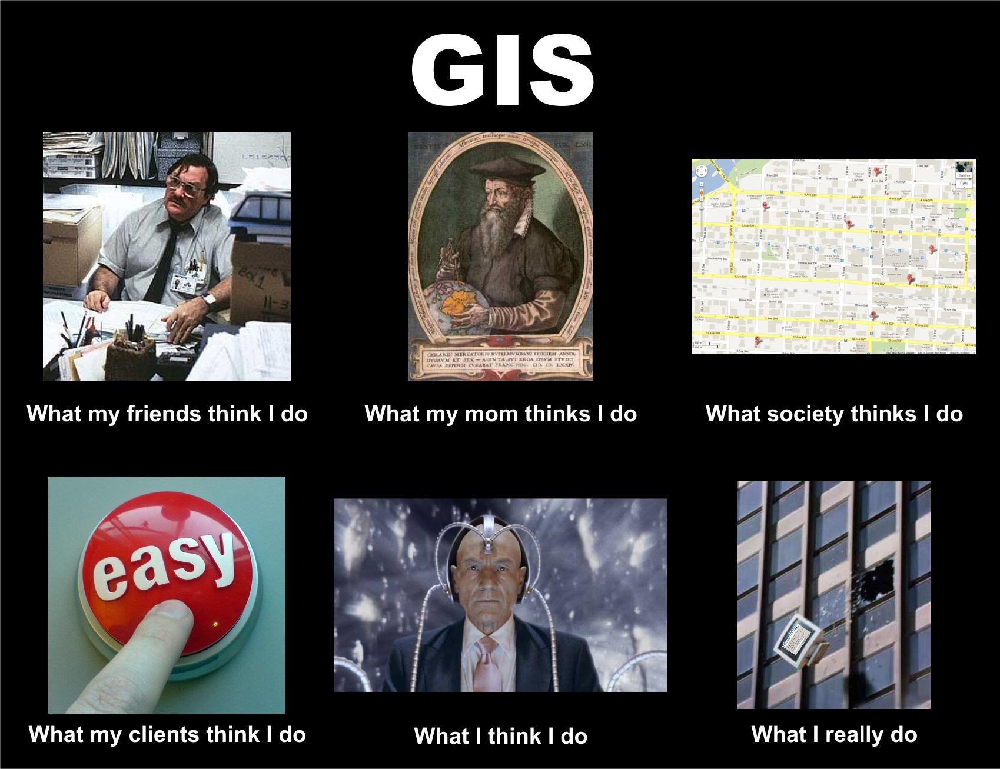

<!--============ intro -->
# Hello
<!-- .slide: data-background="./gland_assets/cambridge.jpg" -->
note: 1. privileged to talk, though will be overshadowed by my predecessor! 2. first visit, would like to join in future talks 3. general introduction of the part of the work might be of some interest to you, open up and focus on discussions on topics 4. learn from you! I have got substantial support from IT already. 5. Best practices comments


# GIS analyst

note: self taught coder, know enough to know I'm quite rubbish as a coder.


# Data management

## The World Heritage Database
- Postgres + PostGIS
- ArcSDE (with `pg_geometry`)
note: reasons of this setup: get the best of the two worlds. Esri editing and library, SQL: standard way of storing and manipulating data. Esri way of doing things vs the way people outside GIS do things


# Data analysis
- pick the right coordinate system
- overlay analysis
- calculate stats

## Postgres/PostGIS
- `st_intersects`

## esri way
- macro: feature class or layer 
```python
arcpy.intersect_analysis()
```
- micro: feature
```python
arcpy.da.SearchCursor()
arcpy.Geometry()
```

## rasters
- esri spatial analyst
- convert raster to a numpy array -> `numpy`, `scipy`, `pandas` and `matplotlib`

## spatial analysis is expensive

## 1. do once only
note: expensive, design the analysis in finer grain -> future analysis involves non spatial -> faster

## 2. divide and conquer
note: current one core only, GIS slow to catch up, massive under utilisation on memory + computing resources

## functional style
note: easy to debug and keep it simple


# Presenting information (knowledge)

## my (real) job
```python
mxd = arcpy.mapping.MapDocument(mapdocument)
for each in wdpalist:
    exportpng = exportfolder + os.sep + str(each) + '.jpg'
    query = '\"wdpaid\" = ' + str(each)
    layer_index.definitionQuery = query
    # set dataframe coordinate system
    sr =arcpy.SpatialReference()
    sr_string = GetFieldValueByID_mk2(layer_index, 
    	each, value_field='utm')
    sr.loadFromString(sr_string)
    df.spatialReference = sr
	arcpy.mapping.ExportToJPEG(mxd, exportpng, 
		"PAGE_LAYOUT", resolution=reso, jpeg_quality=60)
```
note: map batcher 7000 maps. VBA (buggy), python (re-wrote). 

## python viz libs
note: flexible library

## embrace the web (est 2015)
note: seen the power; cannot agree more; embrace it or risk losing my job


# knowledge lab
<!-- .slide: data-background="./gland_assets/b1.jpg" -->

<i class="fa fa-question fa-5x"></i>
## why

## theory of change
<!-- .element: class="adj-icon" -->
<br>
<span class="fragment"><i class="fa fa-map-o fa-2x"></i></span>
<span class="fragment"><i class="fa fa-long-arrow-right fa-2x"></i>
<i class="fa fa-smile-o fa-2x"></i></span>
<span class="fragment"><i class="fa fa-long-arrow-right fa-2x"></i>
<i class="fa fa-pagelines fa-2x"></i></span>
note: For the past two years, I have been putting a lot of thoughts and I keep asking myself what is it that we want to achieve at the end of the day: I want to create a best possible analysis/report, and I want people use them, and influence policy and change behaviour, ultimately to better conserve the planets’ most outstanding places.

## I haven't got there, yet...
<!-- .slide: data-background="./gland_assets/dogfail.gif" -->

## *'theory'* of change
<!-- .element: class="adj-icon" -->
<br>
<span class="fragment"><i class="fa fa-database fa-2x"></i></span>
<span class="fragment"><i class="fa fa-long-arrow-right fa-2x"></i>
<i class="fa fa-book fa-2x"></i></span>
<span class="fragment"><i class="fa fa-long-arrow-right fa-2x"></i>
<i class="fa fa-frown-o fa-2x"></i></span>
note: I have the privilege to have worked on various projects contributing to IUCN's e, m, upstream <br> 
the reality
a) painstakingly compile a lot of biodiversity observation data, sometimes modelled abstruse data; b) turn these data into even more abstruse scientific analysis and thick papers 3) our audience find it hard to understand and use - > didn't achieve the impact: <br>
a) not good enough work; b) just not enough packaging - making their life difficult?

<i class="fa fa-flask fa-5x"></i>
## what

## bridge the gap
between generation and uptake of knowledge products
note: a) KL is what I hope will be initiative, the vehicle to carry that thinking and address the problems <br>
b) to bridge the gap or better facilitate between production of knowledge products and their consumption - in order be more impactful.<br>
c) I want a shift of delivering such analytical work to 1) easy to access and understand 2) more public facing, communication oriented

## promote the use of web
in communicating analytics and digital tools
note: 
a) to better reach audience by tapping into opportunities it offers 1. direct and ubiquitous access with internet 2. interactive and engaging 3. dynamic and agile, i.e., quick to modify and improve <br>
b) reports are less appealing, if I, as an author, can’t be bothered to read my own work of 70 pages. I find it powerless to convince other people to read. <br>
c) five minutes attention span. fundamentally there is too much information and too little time - People are busy, swamped by information around them, spoiled by the influx of wealth of information.

## central hub
for all digital products in the making
note: 1) physical manifestation. <br> 
2) single entry point for all products, making it easier to navigate <br>
3) initially all MAVA deliverables under activity 1.2 but could be a common place for any work-in progress digital products in the future

## collect ideas
for improvement and future development
note: a step at a time. incremental improvement (as opposed to disruptive innovation), needs directions. Platform to gather feedbacks and solicit good ideas.

<i class="fa fa-cogs fa-5x"></i>
## how
note: design principles; KL itself but also for each knowledge product in the lab

## keep it simple
(and do less!)
<!-- .element: class="fragment" -->
note: 1. it is not rocket science, nor even research we do - risk losing out of touch - no need to be complicated and full of jargons. <br>
2. it is about what we do; but also about what we don't do -> concious of resource. a) Don't reinvent wheel. b) Do less but do it very well.
3. concious of limited resources; one thing at a time, set ambitious goals but with achievable low aims

## extendible and scalable
link, provide services, and extend beyond WH
note: with future extendibility in mind. <br>
1. intrinsically not in isolation - imperative connection to existing more established KP <br> 
2. easily extendible to have additional functionality. modern architecture, web services <br>
3. WH trailblazing, but equally could be scaled up to other protected areas

## open
Data, methodology and result
note: open data, open technology and open accessibility. Source code, analytics reproducible. empower others.
1. certainly external pressure to be open, because many are open <br>
2. personal view that data etc should not be held back. <br>
3. benefits from transparency: allow comments, healthy debate that leads to better ideas, solution and outcome. 2) empower others

## responsive
any device
note: 
1. maximise accessibility. no matter what terminal device is used. to make it easy for them
2. mobile first design. 

## link
</img>
- <a href='https://yichuans.github.io/wh-knowledge-lab/' target='_blank'>Knowledge Laboratory</a>
note: link knowledge lab


# climate change vulnerability
<!-- .slide: data-background="./gland_assets/b2.jpg" -->

## on the shoulders of giants
powered by species climate change vulnerability assessments
<!-- .slide: data-background="#3b5998" -->
note: 
1. based on the work by Foden 2012, GSP. <br>
2. reuse their finding and make it relevant for WH

## sensitivity, low adaptability and exposure
<!-- .slide: data-background="#3b5998" -->
note: 
1. the concept: is it sensitive to cc, traits adaptable, will it be exposed <br>
2. only when they are high score of all three, are they considered climate change vulnerable <br>
3. scores are relative. Thus can't compared across taxa

## outlook from the lens of species
<!-- .slide: data-background="#3b5998" -->
note: 
1. infer species within WH using RL
2. aggregate all species CCV results within WH <br>
3. Are species most vulnerable outside WH or inside <br>
4. to what extent do WH provides refugee, high number of ccv species, management responses
5. monitoring work. What are the sites that are ccv? in those sites, what are the species that are ccv? What traits leads to their ccv status? What management response could be? delineation based on future extent of such species?

## link
<!-- .slide: data-background="#3b5998" -->
- <a href='http://nbviewer.jupyter.org/github/Yichuans/climate-vulnerable-wh/blob/master/report.ipynb' target='_blank'>Brief report</a>
- <a href='http://nbviewer.jupyter.org/github/Yichuans/climate-vulnerable-wh/blob/master/workspace.ipynb' target='_blank'>Reproducible methodology, analysis and findings</a>
- <a href='http://wh-app.yichuans.me/ccv' target='_blank'>Result for each natural and mixed World Heritage site</a>
note: versioned, reproducible, communication oriented. first time data analytics: version controlled, open, accessible, scientific product. New thinking of delivering and communicating knowledge product through means other than lengthy text


# land cover change
<!-- .slide: data-background="./gland_assets/b3.jpg" -->

## highest spatial resolution global land cover
GlobeLand30 - 30 meter resolution
<!-- .slide: data-background="OliveDrab" -->
note: first time 30 meter global land cover - datasets two time epochs using the same methodology thus change can be estimated

## pixel by pixel change
From 2000 to 2010
<!-- .slide: data-background="OliveDrab" -->
note: what we did - calculate pixel by pixel change within each WH site

## new perspective for screening potential threats
<!-- .slide: data-background="OliveDrab" -->
note: validation required. it tells you what but not why - another source of potential threats. <br>
1. example, WHO assessment. Could refer to the LCC for any substantial change, if so, this signals an alert, if otherwise unknown, a possible damaging event. forest loss, water body change, amongst others.

## link
<!-- .slide: data-background="OliveDrab" -->
- <a href='http://wh-app.yichuans.me/wh_app/landcover' target='_blank'>Land Cover change</a>
note: first time comprehensive, systematic land class mapping exercise, first time investigated the dynamics of change, first time used the web as a media to deliver findings


# near real-time landsat 8 imagery
<!-- .slide: data-background="./gland_assets/b4.jpg" -->

## what is *remote sensing*?
<!-- .slide: data-background="./gland_assets/rs.gif" -->
note: sense from a distance, on board aircraft and satellite. Valuable, frequent direct observations of features, such as... on the ground from a distance. E.g. look at spetrum of infrared, tell a lot about vegetation.

## Landsat 8 imagery in the cloud
<!-- .slide: data-background="#A45209" -->
note: archiving, no longer relevant -> no need to host data in house while it's ubiquitous and easily accessible

## What do they look like... *NOW*?
<!-- .slide: data-background="#A45209" -->
note: move away from the original goal, frees time for more interest work
1) Time series data, finds the best image (cloud free) in any past given time range. composition of spectra. <br>
2) already an idea or on information that is reported, photographic proof if there is any supporting evidence from remote sensing

<iframe  width="1080" height="600" data-src="https://www.mapbox.com/bites/00114/" frameborder="0"></iframe>
<!-- .slide: data-background="#A45209" -->
note: cloud, web services: data is on the internet and can be easily accessed and customised without the need to download. Computation on the cloud

## future beyond pretty pictures
<!-- .slide: data-background="#A45209" -->
note: as it stands only visuals - immense opportunity and potential to better visualise but also analyse in the cloud.
1) change of NDVI, vegetation index overtime <br>
2) give you land cover classification on the fly, dynamically (GEE) - tell you also what they are and how they change

## link
<!-- .slide: data-background="#A45209" -->
- <a href='http://wh-app.yichuans.me/landsat' target='_blank'>Landsat 8 for natural World Heritage</a>
note: first web service based product. Dynamic in that as long as new data comes in, the maps will be automatically updated. Little or no maintenance cost.


# spatial comparative analysis
<small>(Prototype)</small>
<!-- .slide: data-background="./gland_assets/b5.jpg" -->

## gaps and comparisons, spatially
<!-- .slide: data-background="#8c0303" -->
note: from a data point of view, identify where broad gaps are; if a hypothetical site is to be submitted, how does it compare to existing sites.

## proof of concept
for now
<!-- .slide: data-background="#8c0303" -->
note: to replicate desktop system and make it accessible -> enable wider public to undertake a first screening of their intended sites

## full development
replicating full functionalities of spatial comparative analysis
<!-- .slide: data-background="#8c0303" -->
note: prototype done, delayed in communication due to UNESCO, full specification done and next step fund raising
1. proper spatial analysis <br>
2. complete datasets <br>
3. improved user experience

## link
<!-- .slide: data-background="#8c0303" -->
- <a href='http://whca.yichuans.me' target='_blank'>Spatial comparative analysis prototype</a>
note: web GIS for the first time, complete system that takes input from the frontend interface, pass onto an underlying GIS database for analysis and then return the result to the web.


# Human footprint change in World Heritage sites
<!-- .slide: data-background="./gland_assets/b6.jpg" -->

## (to amplify the impact of a peer reviewed paper)
<!-- .slide: data-background="#3b5998" -->

## tech
<!-- .slide: data-background="#3b5998" -->
- static powered by `python-pelican`
- like a blog **not** a blog

## link
<!-- .slide: data-background="#3b5998" -->
- <a href='http://human-footprint.yichuans.me/output' target='_blank'>Human footprint change</a>


# questions
<!-- .slide: data-background="./gland_assets/b8.jpg" -->


# Thank you
<!-- .slide: data-background="./gland_assets/cambridge.jpg" -->
Yichuan Shi <br>
<a href="#/"><small>restart</small></a>
