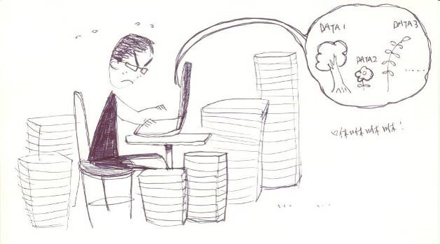
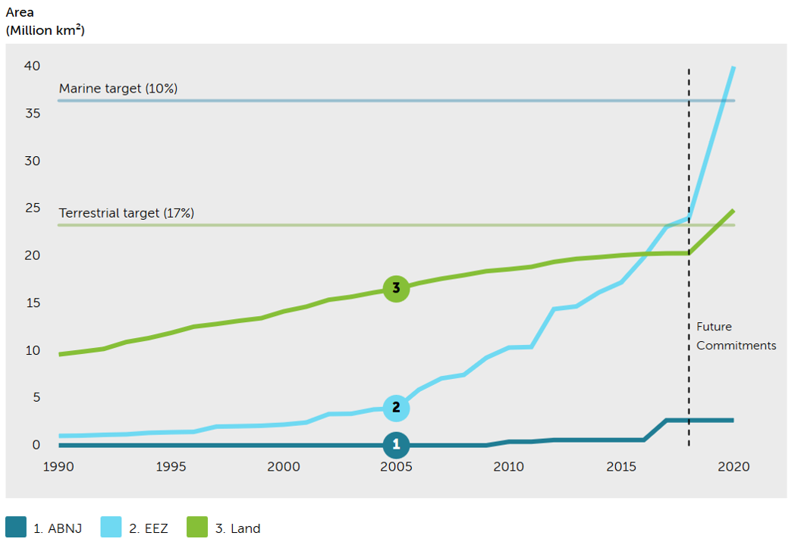
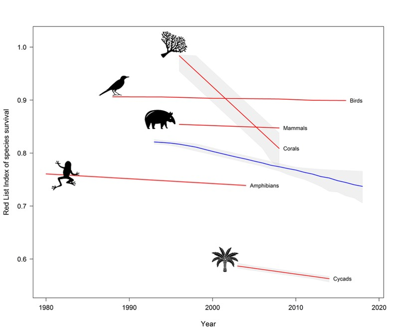
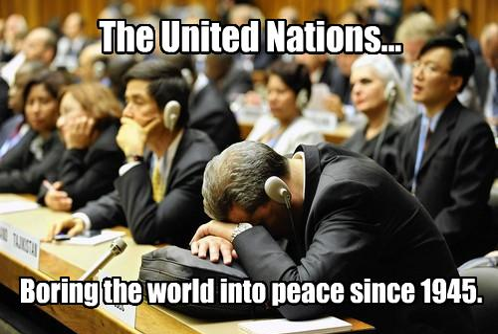
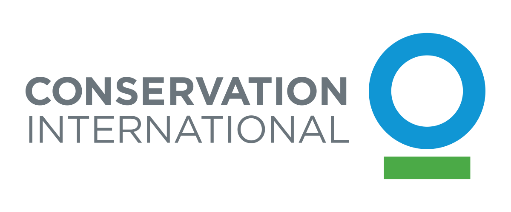
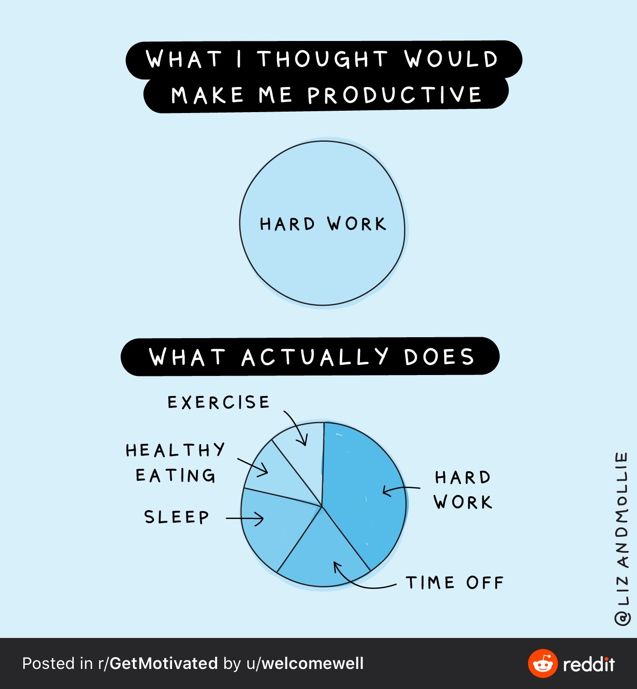

# 3606 Days
<!-- .slide: data-background="./generic_assets/welcome.png" -->
219 Huntingdon Rd  
Yichuan Shi   
<small>March 2020</small>

## I am a mapmaker
<!-- .slide: data-background="./generic_assets/welcome2.png" -->
note: maps have a special place in my heart; GIS and remote sensing specialist by training

### Why I got hired
<!-- .slide: data-background="white" -->

note: Interned WCMC Global Island Database with Corinna and Simon; Was not good enough I suppose, as I didn't get a job with WCMC, but started volunteering for species programme with IUCN. ATT they had a challenge of creating isotropic hexagonal grids globally at scales for analysing richness of vertebrates species. With no prospect of finding a job in the UK, I had to return to China amidst the financial crisis 2008-2009 but later got a phone call from IUCN asking if I'd be interested in a job - yeah, job interviews at that time was easy - I probably would not get a job now with the competition, but I sneaked in! I guess I did two things right: 1)I outsourced/consulted the work to a university friend for advice manipulating text coordinates generated by the programme to remove vertices that are around 180 longitude 2) I fixed the bug for counting species richness, especially binning polygons based on a grid of some sort, written in VBA, now extinct language. 3) I can make maps

### All maps are wrong!

<!-- .slide: data-background-video="./leaving-wcmc-assets/map-lies.mp4" data-background-size="contain" -->
note: I'm not undermining my own work but it is true! All maps are abstractions of the real world, as such they cannot, by definition, be 100% true, otherwise there is no point in making maps as we would be overwhelmed by unnecessary details. It is necessary to sacrifice details or noises to focus on important things of interest to us. BUT the things of interest are inherently biased even though we do not notice them. Further more, as human beings our perceptive capability is rather limited in that colours, sizes (or perception of ), shapes all influence our perception and ultimately judgment and actions. All Maps are wrong, yes they can be deceiving but some maps are more useful than others!

## Teach computers
<!-- .slide: data-background="black" -->
<video loop data-autoplay data-src="./leaving-wcmc-assets/control.mp4" type="video/webm">
</video>
note: I enjoyed immensely working with computers, which I still do. This is perhaps the closest thing to doing magic. But it was pretty hard as I had little idea how to do it - I had to teach myself while doing lots of manual labour, which i later discovered was what the IUCN job was about. There was a constant struggle why things did not work, or why they worked when they do, but resourceful, young, didn't have a girl friend or family. Automating things or to the extent possible, delegating work to computers and making my life easier what fundamentally what gave me strength to work. What I learned was that 1) there is no point in doing the same thing over and over again - this is a waste of creative power and mental energy 2) there are many ways of skinning a cat and there is a point in trying them out even at times doing things in a different way may mean spending more time 3) doing deep and extra work may not sound a fair trade but it eventually pays off. 

### Data analysis
Tricky but useful
<!-- .slide: data-background="./leaving-wcmc-assets/fibonacci.gif" -->
note: I remember HR said something very interesting about I petrify interns because once I gave interview questions about Fibonacci series - I think that's an interesting but perhaps less forgiving characterisation of my reputation. No, just to clarify, I don't petrify interns. There is some truth in it that I work a lot with numbers but I don't like them, perhaps I'm not sufficiently good at them. The point I really want to make is that spatial analyses are never easy - don't take them for granted (okay they are always conceptually simple, but never easy to crack on). The point is the importance work is often understated.

### When it goes wrong
...and it will
<!-- .slide: data-background="black" -->

note: i guess it's not when but it is about how often - in fact it goes wrong all the time. and I think for those of you who work with data on a regular basis can empathise how much time we spend investigating, fixing, re-running. How much time, headaches and lost opportunity over these. Computers do not perform what you think it'd do, it crashes, or a logical error on methodology. What I've learned is to look at the data - most likely the source of frustration - is it formatted well, is it too chunky for computers to chew, is there another way to go about the same process using a different tool. In case it's spatial, asking gurus in the GIS hub usually helps - they are wonderful

## World Heritage
Crown jewels of protected areas
<!-- .slide: data-background-image="./leaving-wcmc-assets/wulingyuan.jpg" data-background-opacity="0.5" -->
note: Many of you may not know that the centre engages a lot of work on WH. Evaluation, monitoring and upstream research and capacity building. Impactful work, science policy interface, in preserving most outstanding protected areas the centre provides significant support from its infancy, we had been more directly involved with dossier... out of flavour, we focus on providing comparative analysis of all nomination under biodiversity criteria - Elise, Osgur, Claire, marine... 

### Effective mechanism
for conservation  
<!-- .slide: data-background="white" -->

note: most people associate with pretty places. The most effective mechansims of area based conservation - 1) strict protection and management as a pre-requisite for inscription, subject to regular international scrutiny and access to increased funding, internationally as well as domestically 2) Incentive many countries pride themselves for having site - they want to have it 3) financials.and an importance source of income, through tourism directly or indirectly. The endanger list can help with channelling attention and funding for corrective measures.

### Inconvenient truths
Science, politics, and diplomacy
<!-- .slide: data-background="white" -->

note: jNo pun intended - it's better squabbling over insignificant details and be boring rather than discussing topics of grave consequences - like peace or saving lives. So it's a good sign :). The fact we are not talking about things of grave consequences and squabbling over how many sites can be nominated is definitely a good sign.
1) science: every year we produce comparative analysis aimed to inform the IUCN panel, where official recommendations are made - heed only when convenient
2) Corridor politics by career diplomats not scientist or cultural professionals, but socio-economic, geopolitical, and really trading favours between diplomats - if the recommendation is positive... if not, we disagreed - clearly shows outstanding values... it's easier to defend with natural values that can be quantified, far more difficult with cultural values.
3) Especially on monitoring, give more time and opportunity for the country of interest to develop corrective measures and more reporting - the thing with reporting and doing thing expiry dates - when it ceases to be a priority, uninterested, unfocused, and gradually forgotten...
This is also when I felt doing reports and undertaking good science alone is not sufficient to push for change, at least. Too slow - and disheartening and demotivating. That's when I started doing something very different.

## Technology
<!-- .slide: data-background-iframe="./krakow_assets/globe.html" -->
note: I must admit that I own a lot to 1) time saved through computers and 2) keeping a blind eye to me spending more time re-inventing the wheel. 
shift my focus to tech. with the time saved, I taught myself programming for the web about five years ago... build a few websites, apps and tools. Not for the sake of the web, instead of producing lengthy reports and powerpoints, I made efforts to communicate via the web as a new media. If I can't be bothered to read my own works of 70 pages, it is highly probably I won't be able to convince others to read.

<h2>I built websites</h2>

to illustrate the utility of using the web as a means to communicate otherwise text heavy messages

<!-- .slide: data-background-iframe="http://world-heritage-analyses.iucn.org/" data-background-interactive -->
note: where I started - empowering experience - 1) sense of being a maker of things - portfolio to show, in this case easier to visualise work easily 2) usefulness aside, they are interesting 3) enable others and empower others. E.g. priority, datasheets

### a different perspective
reinventing the obvious
<!-- .slide: data-background-video-loop="true" data-background-video="/leaving-wcmc-assets/perspective.mov" data-background-size="contain" -->
note: I started to attract attention, deliver information in a way that's a bit unconventional, more interactive and engaging, easier to digest and gain a better retention rate. It is also well-known to disrupt and re-invent existing practices through creative destruction.
There are a lot of things we all agree that are great, collaboration, streamlining workflow and process to follow - at the same time, we think they are challenging to do, too many coordination: too complex, adoption will be low; too simple, no utility - therefore worth doing but won't get there. Technology offers an alternative and can disrupt.

### what I learned
<!-- .slide: data-background-iframe="./krakow_assets/cp.html" -->
doing things the tech way

<iframe width="900" height="500" src="https://www.youtube.com/embed/BOLWQs-YXu4?rel=0;autoplay=1&mute=1&controls=0" frameborder="0" allowfullscreen></iframe>
note: Example of how a complex project can be done. A group of developers coding is no different to collaboratively working on a number of documents - track changes with multiple comments, iterations and revisions, my version vs your version, his updated version without considering my comments. Same headaches but magnified 100 times.
Address social element of work - collaboration, commitment and acknowledgement - the best idea wins and is basically a meritocracy. 
A few other things: a) Users are ultimate judge of your products. b) the best design is there is no design - good design should be self-evident and requires no instructions or user manuals. c) engineer's mindset, open, free access, explicit collaboration; source code management is key to produceability, repeatability and sharing, advocate for any coding scientists

## WDPA is fantastic!
<!-- .slide: data-background-image="./leaving-wcmc-assets/wdpa.jpg" data-background-opacity="0.25" -->
note: Take this opportunity to shamelessly promote the work of our team; those of you haven't worked on it probably don't know how important it is to the centre. If you consider once the IUCN Red List was the product of the centre, you can easily appreciate how important it should be. 1) hugely beneficial in informing decision making 2) powering global research, scientific study, as well as derivative products, systematically maintained via non-public funding.

### flagship knowledge product
...and it can do much more
<!-- .slide: data-background="./gland_assets/rs.gif" -->
note: some are already underway: not static, change of global protected area estate, effectiveness of protected areas, land cover change, prediction under climate change scenario, systematic conservation planning etc. Nothing new as we have been wanting to do them for years

### bottle-neck
<!-- .slide: data-background-image="./leaving-wcmc-assets/bottleneck.jpg" data-background-opacity="0.5" -->
note: our time trapped in our mandate - keeping it up to date. Struggling to fund limited capacity 1) repetitive work (innovation - productivity and valued added work). growth, and provide opportunity internally for career development and externally for increased impact. WDPA remains the most well known data product of the centre - otherwise it's going to be huge lost opportunity. 1) not able to have metric of how effective they are - simply knowing where is not sufficient 2) more countries, more updates and more accurate - we need to grow. There are challenges, obvious and compelling reasons but it does not mean we should not try because if we don't try we might risk being made obsolete.

## Business and IBAT

<iframe width="900" height="500" src="https://www.youtube.com/embed/YnpngcuoUDk?rel=0;autoplay=1&mute=1&controls=0" frameborder="0" allowfullscreen></iframe>
note: very fortunate to have had the experience of working with business and the IBAT team. I learned a great deal from it. The truth is that businesses have huge power, their interest reflect the interest of the our society y. Great admiration for the work of the business programme - not just serving the needs of business partners, but source of sustainable income but also great leverage power. I story to share - from an Established conservationist, her greatest moment in conservation is persuade not to spend money setting up philanthropic foundations but use the money to improve their supply chain. I think IBAT is a great example of how business could be part of the solution by creating a funding mechanism for databases which everyone needs but nobody wants to pay for it, but also get the informed conservation decisions out there in the field. Can be done differently - with excitement I watch this space and I think lots of great things are yet to come.

## what next?

note: I'm going to the field - thematically, blue carbon, wetland, species conservation and protected areas, projects in China. The views from the other end of the spectrum, learning new skills outside of my comfort zone, everything about working in China.

### win, win, win
<!-- .slide: data-background="./leaving-wcmc-assets/social-enterprise.jpg" data-background-opacity="0.1" -->
- Save the natural world
- Generate operational surplus
- Create fantastic jobs
note: Having had a brief taste of scientific research, policy, tech and hopefully on the ground, much longer term, idealistic, looking at if there is a way that creates lots of wins. For nature (Mission statement), for the stakeholders (generating profits), and for practitioners (provide ample opportunities attract and retain talents, to empower them, amplify interesting and ample fulfilling career).

## Last one...

note: Jonty shared this before and i cannot agree more. One of the many things I learned from Naomi - everyone needs that head space to function. Physical wellbeing and psychological wellbeing depend on it. Don't drive yourself too hard, slow down and there is more than just work. I think life is a marathon and there is no point in sprinting..

## questions
<!-- .slide: data-background="./generic_assets/question.jpg" -->

## Thank you
Keep in touch!
<!-- .slide: data-background="./generic_assets/welcome2.png" -->
<a href="#/"><small>restart</small></a>
note: having worked at the centre, I've seen people come and leave - massive thank - for the trust in someone who knew nothing, I learned a lot, enjoyed working with you, cannot emphasis more on the important work 