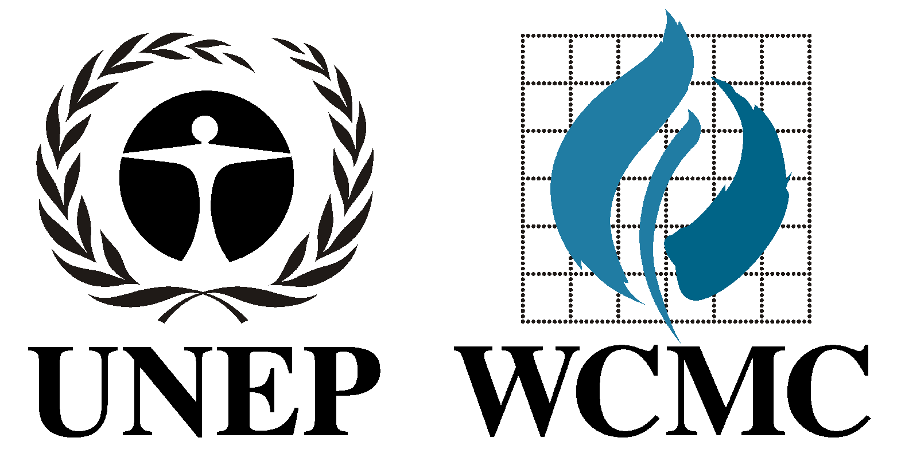
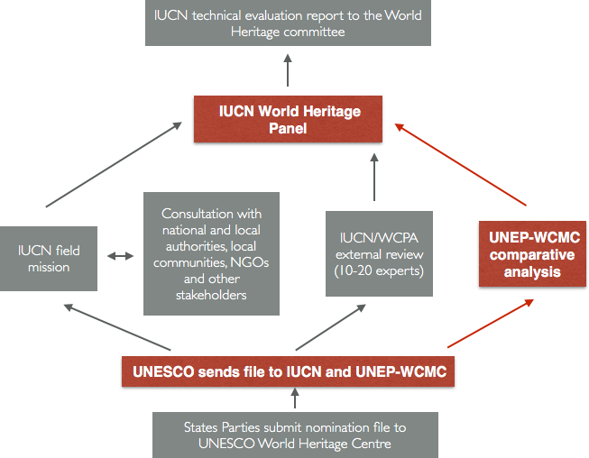

<!--============ intro -->
# welcome
<!-- .slide: data-background="welcome2.png" -->
Note: house keeping (fire exit, toilet, visitor badge); intro me; interrupt me for any questions

<!-- =========== the center -->
## about us
<!-- .slide: data-background="wcmc-0.jpg" -->

United Nations Environment Programme 

World Conservation Monitoring Centre 

(UNEP-WCMC)

Note: 35 yrs +, Cambridge, 100+, biologist, computer scientist, economist, GIS professionals, programmers

## To put biodiversity at the heart of decision-making
<!-- .slide: data-background="wcmc-1.jpg" -->
Note: biodiversity arm of UNEP, most to do biodiv conservation; question: what's biodiversity + answer; 

## Unlock the power of data
<!-- .slide: data-background="wcmc-2.jpg" -->
Note: driven by data, maintain multiple global databases (e.g. ocean data viewer, WH, species trade); analysis/make sense; modelling analytical 

## The strength of many
<!-- .slide: data-background="wcmc-3.jpg" -->
Note: coordination: world wide partners, international, national research, private, NGOs and foundations

## science and policy interface
<!-- .slide: data-background="wcmc-4.jpg" -->
Note: closely with multilateral conventions; measure our impact, not just by how good we do science, but to make sure change for a better conservation outcome

<!--============ convention -->
## the world heritage convention

>Heritage is our legacy from the past, what we live with today, and what we pass on to future generations. Our cultural and natural heritage are both irreplaceable sources of life and inspiration

Note: questions: how much do you know about WH; since 1972, 192 SP, one of the most adhered conventions; one of the most effective for conservation;

### key actors of the convention

- States Parties
- World Heritage Committee
- UNESCO (WHC)
- The Advisory Bodies

### what makes it a World Heritage site?

Note: question

### criteria - management - integrity

---

Note: authenticity in cultural sites

### natural criteria

### natural beauty

<video data-autoplay>
<source data-src="sanga.webm" type="video/webm" />
</video>

Note: biodiv site Sanganeb Marine national park and dunonab bay, Sudan 2016, (vii)(ix)(x)

### geological features

<video data-autoplay>
<source data-src="mistake.webm" type="video/webm" />
</video>

Note: geological site, Mistaken point, Canada 2016, (viii)

### ecological processes

<video data-autoplay>
<source data-src="hubei.webm" type="video/webm" />
</video>

Note: biodiversity site, Hubei Shennongjia, China 2016, (ix)(x)

### species and habitat

<video data-autoplay>
<source data-src="wts.webm" type="video/webm" />
</video>

Note: biodiversity site, W Tien-shan, Kazakhstan/Kyrgyzstan/Uzbekistan 2016, (x)

<!--============= our work -->
## world heritage at UNEP-WCMC

Support IUCN (International Union for Conservation of Nature) on biodiversity sites.

- Evaluation of new natural and mixed nominations  <!-- .element: class="fragment"-->
- Monitoring of existing sites  <!-- .element: class="fragment"-->
- Policy, guidance and research <!-- .element: class="fragment"-->
Note: question: what is it we do - well...

<!--============== evaluation -->
## 1. Evaluation
<!-- .slide: data-background="white" -->

### The process

<!--  -->

### World Database on Protected Areas
<!-- .slide: data-background="pp.png" -->
<a target='_blank' href='http://www.protectedplanet.net'>protected planet</a>
<!-- only way to allow new page -->
Note: much of the evaluation we do rely on it. DEMO

### Comparative Analysis

For biodiversity nominations

Note: unbiased, impartial, independent expert assessment. Data driven, literature...

### Online prototype for spatial screening
<!-- .slide: data-background="ca.png" -->
<a target='_blank' href='http://whca.noip.me'>comparative analysis</a>

Note: enable others to look at nomination, costly process

<!--============== monitoring -->
## 2. Monitoring
<!-- .slide: data-background="white" -->

### Statutory process
Note: periodic reporting (6 years), SOC report, reactive/reinforced monitoring/missions, danger listing, and ultimately de-list

### We need to be proactive
Note: often slow to react, often too late

### world heritage outlook
Example: <a target='_blank' href='http://www.worldheritageoutlook.iucn.org/search-sites/-/wdpaid/en/2571'>The Great Barrier Reef</a>
Note: IUCN initaitive to pro-active, identify issues before major, effective mitigation measures

<!-- .slide: data-background-image="who.jpg" -->
Note: mobilise voluntary expert groups across the world, impartial assessment conservation outlook, every five years to see trend

### monitoring forest loss
<a target='_blank' href='http://www.globalforestwatch.org/map/'>Global Forest Watch</a>

<!-- .slide: data-background-image="10902.png" -->
Note: make use of 30m global forest loss data

### remote sensing
<!-- .slide: data-background-image="rs.gif" -->
Note: powerful, cost efficient way for large scale monitoring

<!-- .slide: data-background-image="l8_okavango.gif" -->
Note: okavango delta, landsat 8, 30 meter resolution

<iframe  width="1080" height="700" data-src="https://earthengine.google.com/iframes/timelapse_player_embed.html#v=22.16343,113.56346,11.601,latLng&t=2.43" frameborder="0"></iframe>
Note: powerful computation, big data. Macau, google earth engine

### Land cover change
<a target='_blank' href='http://wh-app.noip.me/wh_app/landcover/'>Natural World Heritage sites from 2000 to 2010</a>

<!--============== upstream -->
## 3. Policy, Guidance and Research
<!-- .slide: data-background="white" -->

<!-- ## original 1-->
<!-- .slide: data-background="carto-0.png" -->
Note: the WH convention is not without its problems; one of which is the huge divide geographically and politically

<!-- ## cartogram by number of sites -->
<!-- .slide: data-background-image="carto.png" -->

### best practices guidance documents
Note: reports etc

### thematic studies

Note: terrestrial biodiv, marine WH, benefits study, published in Science

### climate change
<!-- .slide: data-background="ccv.png" -->
<a href='http://wh-app.noip.me/ccv' target='_blank'>Climate Change Vulnerability for World Heritage</a>

# Questions
<!-- .slide: data-background="question.jpg" -->

# Thank you

Yichuan Shi

<small>yichuan.shi@unep-wcmc.org</small>

<a href="#/"><small>restart</small></a>
